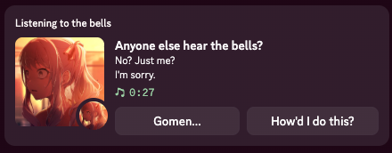
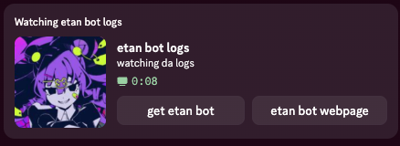

# etan's custom rpc

a custom rpc handler for discord, made in python, powered by pypresence.

## Quickstart

Clone the repository, and grab the required modules:

`pip install -r requirements.txt`

Then, run `customrpc.py`, fill out the newly created `presets.json` file, re-run `customrpc.py`, select a preset, and run!

## Screenshots

